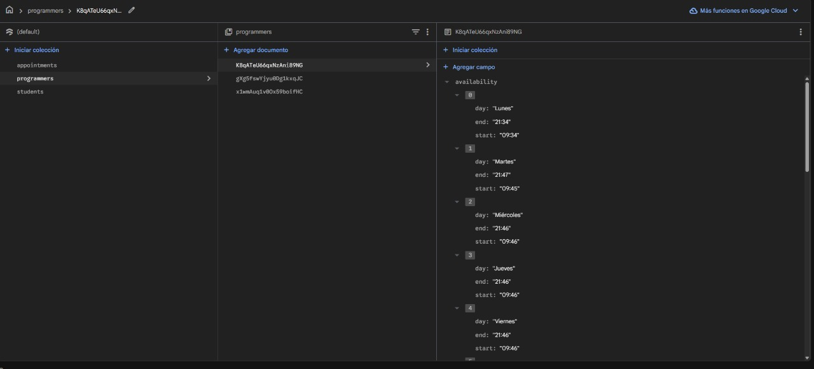
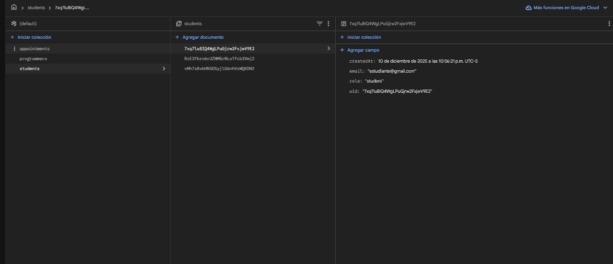

# Net_Academy: Sistema de Gestión de Portafolios y Asesorías Académicas


> **Proyecto Integrador de Fin de Ciclo**  
> **Asignatura:** Programación y Plataformas Web  
> **Periodo Lectivo:** Octubre 2025 – Febrero 2026  

---

## 📑 Tabla de Contenidos
1. [Información Institucional](#1-información-institucional)  
2. [Resumen Ejecutivo](#2-resumen-ejecutivo)  
3. [Objetivos del Proyecto](#3-objetivos-del-proyecto)  
4. [Arquitectura de Software](#4-arquitectura-de-software)  
5. [Ingeniería y Desarrollo](#5-ingeniería-y-desarrollo)  
6. [Diseño de Interfaz (UI/UX)](#6-diseño-de-interfaz-uiux)  
7. [Instalación y Despliegue](#7-instalación-y-despliegue)  
8. [Conclusiones](#8-conclusiones)  

---

## 1. Información Institucional

| **Entidad** | **Detalle** |
| :--- | :--- |
| **Universidad** | Universidad Politécnica Salesiana |
| **Carrera** | Computación / Ingeniería de Software |
| **Asignatura** | Programación y Plataformas Web |
| **Docente** | Ing.Pablo Torres |
| **Desarrolladores** | Juan Diego Torres & Ariel Calle |
| **Fecha de Entrega** | Diciembre 2025 |

---

## 2. Resumen Ejecutivo

**Net_Academy** es una plataforma web desarrollada como una **SPA (Single Page Application)** construida con **Angular 17+**. Su propósito es conectar a estudiantes que requieren asesorías académicas con programadores que desean gestionar su marca personal a través de portafolios digitales profesionales.

El proyecto funciona completamente sobre una infraestructura **Serverless** proporcionada por **Firebase**, integrando autenticación segura, Firestore como base NoSQL en tiempo real y hosting para despliegue continuo. Visualmente, la aplicación adopta un estilo **Cyberpunk/Sci-Fi**, usando **TailwindCSS** para crear una experiencia moderna, llamativa y orientada al público tecnológico joven.

---

## 3. Objetivos del Proyecto

### 🎯 Objetivo General
Crear una plataforma web que permita gestionar portafolios multiusuario y administrar asesorías académicas, diferenciando roles y proporcionando herramientas personalizadas para cada tipo de usuario.

### 🎯 Objetivos Específicos
1. Implementar **Control de Acceso Basado en Roles (RBAC)** mediante Guards de Angular.  
2. Desarrollar la **gestión dinámica de portafolios** con CRUD de proyectos.  
3. Crear un **sistema de agendamiento de asesorías**, incluyendo validación de horarios y flujo de aprobación.  
4. Desplegar el proyecto con **Firebase Hosting** para disponibilidad pública.

---

## 4. Arquitectura de Software

La aplicación sigue una arquitectura modular moderna basada en:

- **Angular 17+ Standalone Components**  
- **Signals & inject()**  
- **RxJS** para flujos reactivos  
- **Firebase BaaS**  
  - Authentication  
  - Firestore  
  - Hosting  
- **TailwindCSS + DaisyUI** para un diseño visual ágil y adaptable  

---

## 5. Ingeniería y Desarrollo

### 5.1. Módulo de Autenticación y Seguridad

Se implementó un flujo de autenticación inteligente con redirección según el rol del usuario. Los *Functional Guards* protegen rutas críticas.

Ejemplo de `adminGuard`:

```ts
// src/app/guards/auth.guard.ts
export const adminGuard = () => {
  const auth = inject(Auth);
  const router = inject(Router);

  return authState(auth).pipe(
    take(1),
    map(user => {
      if (!user) {
        router.navigate(['/login']);
        return false;
      }
      if (user.email === 'a.calleduma123@gmail.com') {
        return true;
      }
      router.navigate(['/home']);
      return false;
    })
  );
};
````

---

### 5.2. Módulo de Administración

Panel exclusivo para el Administrador, con capacidades:

* Crear programadores
* Editar información
* Deshabilitar o eliminar perfiles
* Filtrar por especialidad
* Modales dinámicos
* Integración con Firestore mediante `UserService`

---

### 5.3. Módulo del Programador (Command Center)

Este panel representa el "cockpit" donde el programador controla todo:

#### Portafolio:

* CRUD de proyectos
* Clasificación: Académicos / Laborales
* Tecnologías, enlaces, repositorios

#### Gestión de Solicitudes (Tiempo Real):

* Escucha activa de la colección `appointments`
* Aprobación / Rechazo instantáneo
* Justificación obligatoria

Ejemplo:

```ts
async respondAppointment(app: any, status: 'Aprobada' | 'Rechazada') {
  if (!app.replyMessage) {
      this.showAlert('⚠️ REQUERIDO', 'Debe justificar la respuesta.', 'warning');
      return;
  }
  await this.advisoryService.updateAppointmentStatus(app.id, status, app.replyMessage);
  this.showAlert('¡LISTO!', `Solicitud ${status} correctamente.`, 'success');
}
```

---

### 5.4. Módulo Estudiante y Navegación

Funcionalidades:

* Buscador inteligente por nombre, tecnología o especialidad
* Visualización del portafolio de cada programador
* Formulario de solicitud de asesoría
* Validación de horarios disponibles

---

## 6. Diseño de Interfaz (UI/UX)

Se desarrolló un diseño inspirado en estética **Cyberpunk**:

### Paleta Principal:

* **Fondo:** `#050505`
* **Neon Red:** `#FF003C`
* **Cyan Cyber:** `#00F3FF`
* **Tipografía:** Orbitron & Monospace

Ejemplo de botón estilizado:

```html
<button class="btn border-0 rounded-sm text-white font-bold tracking-wider
               bg-[#FF003C] hover:bg-[#d10030] 
               shadow-[0_0_15px_#FF003C] transition-all">
  EXECUTE_SAVE_PROTOCOL
</button>
```

---

## 7. Instalación y Despliegue

### 🔧 Requisitos

* Node.js 18+
* Angular CLI 17+

### 🚀 Ejecución Local

```bash
git clone https://github.com/diegotorres006/03-componentes.git
cd 03-componentes
npm install
```

Crear archivo:
`src/environments/environment.ts`

Ejemplo:

```ts
export const environment = {
  firebase: {
    apiKey: "",
    authDomain: "",
    projectId: "",
    storageBucket: "",
    messagingSenderId: "",
    appId: ""
  }
};
```

Ejecutar:

```bash
ng serve -o
```

### 🌐 Producción

El proyecto está desplegado en Firebase Hosting.

**URL Pública:** 
(https://portafolio-calle-torres-2025.web.app/admin)*

---


## 8. Conclusiones

* **Integración Exitosa:** Angular + Firebase permitió un desarrollo rápido y modular.
* **Seguridad Robusta:** Guards y roles garantizan acceso controlado.
* **Escalabilidad:** Standalone Components soportan crecimiento del proyecto.
* **Experiencia Visual:** El tema Cyberpunk brinda identidad y claridad.

## 9. Anexos

Esta sección contiene evidencia visual y documentación complementaria generada durante el desarrollo de Net_Academy. Cada imagen está acompañada de una descripción técnica que explica su relevancia dentro del proyecto.

📎 9.1. Diagramas y Evidencias del Sistema


📌 Imagen 1 – Arquitectura General del Sistema

 

Descripción:
Diagrama de la arquitectura del proyecto donde se muestran los módulos principales de Angular, el flujo de datos reactivo (RxJS) y la integración directa con Firebase (Authentication, Firestore y Hosting). Representa cómo opera la aplicación como una SPA modular.


📌 Imagen 2 – Modelo de Datos en Firestore

 

 

 

Descripción:
Estructura documental del sistema: colecciones programmers, projects, appointments y students. Se detalla el uso de claves auto generadas, subcolecciones y referencias cruzadas que aseguran eficiencia y escalabilidad en consultas.

📌 Imagen 3 – Dashboard del Programador (Command Center)

 

Descripción:
Captura de la interfaz principal del programador. Muestra el panel de control donde se gestionan proyectos, solicitudes de asesoría y estadísticas. Refleja la estética Cyberpunk basada en TailwindCSS.


📌 Imagen 4 – Flujo de Agendamiento del Estudiante

 

 

 


Descripción:
Interfaz utilizada por los estudiantes para solicitar una asesoría. Se visualiza el formulario validado, las opciones disponibles según la agenda del mentor y el proceso de envío hacia la base de datos en tiempo real.

📌 Imagen 5 – Panel de Administración

 

Descripción:
Pantalla del administrador del sistema. Aquí se muestra la creación, edición y eliminación de programadores, junto con filtros dinámicos por especialidades. Destaca el uso de modales y tablas generadas con componentes reutilizables.

---

© 2025 Net_Academy Development Team
Universidad Politécnica Salesiana – Sede Cuenca